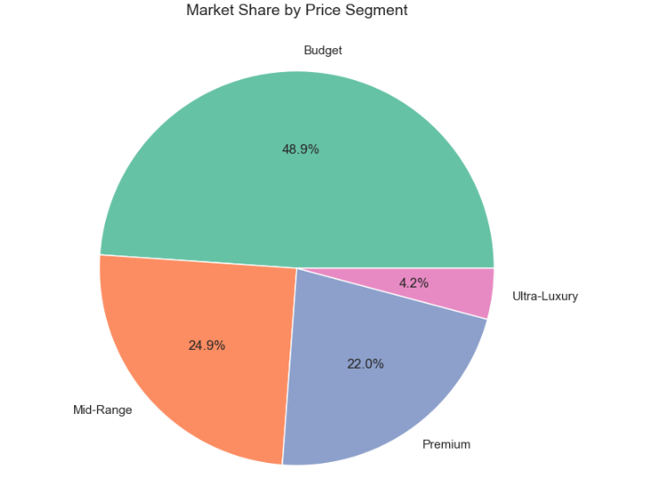
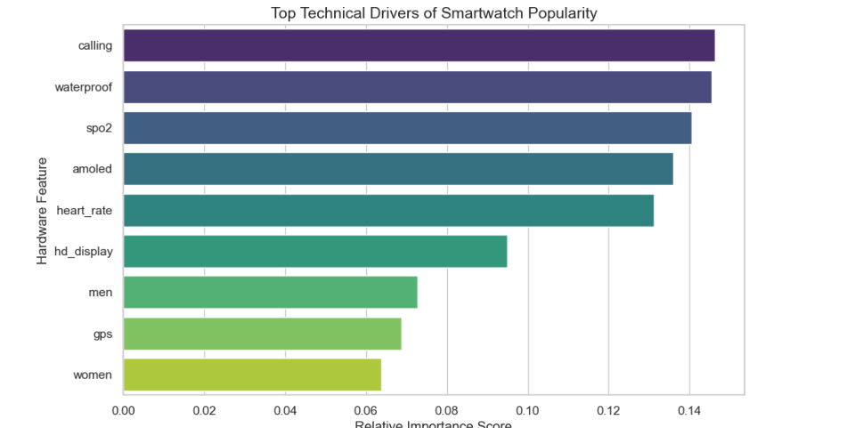
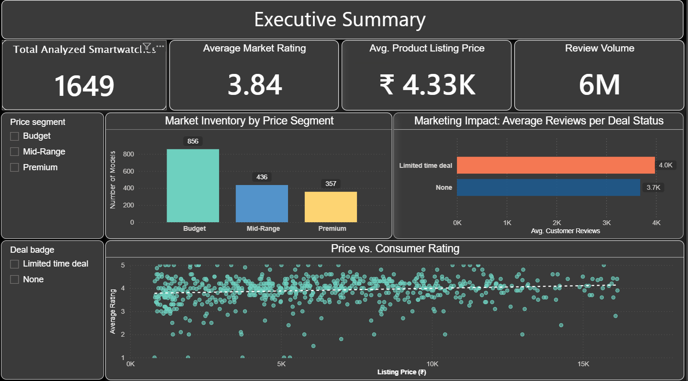

# Smartwatch Market Intelligence & Launch Blueprint

## Project Overview
This project delivers an end-to-end data-driven market entry strategy for the highly saturated Indian smartwatch sector. By engineering a custom data acquisition pipeline, optimizing an ensemble machine learning classifier, and designing a strategic Power BI dashboard, this study moves past anecdotal evidence to define a mathematically validated blueprint for product launch success.

The primary objective was to define a strict **'Popularity Benchmark'**—calculated as reaching the top 20% of the market in review volume with at least a 4.0-star rating—and mathematically isolate the hardware and promotional configurations required to achieve it.

##  Tech Stack & Architecture
* **Data Extraction:** Python (`BeautifulSoup`, `requests`)
* **Exploratory Data Analysis & Modeling:** Python (`pandas`, `NumPy`, `scikit-learn`, `seaborn`)
* **Machine Learning Engine:** Random Forest Classifier optimized via `GridSearchCV`
* **Business Intelligence Engine:** Power BI Desktop

---

##  Core Insights & Findings

### 1. Market Concentration & The Commodity Trap
Analysis of the curated dataset reveals that the Indian smartwatch sector is heavily weighted toward affordability. The **Budget segment (48.9%)** and **Mid-Range segment (24.9%)** combine to account for nearly 74% of all listings. 

Furthermore, feature isolation revealed a critical algorithmic bottleneck: **100% of direct competitors offering the "Essential Trio" (Bluetooth Calling, Waterproofing, and SpO2 Monitoring) are compressed into the lowest budget pricing tier.** These features are baseline expectations rather than premium differentiators. 

 *(Optional: Replace with your Power BI market share chart)*

### 2. Predictive Launch Metrics
To identify the true drivers of success, a Random Forest classification model was trained using 10-Fold Stratified Cross-Validation and optimized using balanced class weights to handle the native 84:16 class imbalance.
* **Overall Accuracy:** 77%
* **Minority Class Recall:** 67% (Successfully identifying 2/3 of true market leaders based on hardware specs alone)

The model's Gini Importance scores mathematically established the hardware hierarchy, proving that leaving out even one element of the "Essential Trio" breaks the decision path to popularity.

 *(Optional: Replace with a snip of your Random Forest Feature Importance chart)*

### 3. Promotional Algorithmic Blind Spot
While promotional **"Deal Badges"** are highly correlated with rapid review accumulation and high velocity, **only 19% of active competitors utilize them**. This represents a massive **81% strategic gap** that a new market entrant can exploit to gain immediate visibility.

---

##  Dashboard Preview
The clean dataset was deployed to Power BI to build an interactive 3-page executive command center tracking Market Overview, Model Insights, and the final Launch Blueprint.

 *(Optional: Place a full screenshot of your Power BI dashboard here)*

---

##  Repository Structure
* `/scripts`: Raw Python web scraping scripts targeting ~10k e-commerce listings.
* `/notebooks`: Comprehensive data cleaning, IQR outlier filtering, and machine learning pipeline.
* `/data`: Curated dataset imported into the BI layer.
* `/dashboard`: Production-ready `.pbix` interactive business dashboard file.
* `/images`: Visual assets, charts, and dashboard screenshots utilized in this documentation.

##  Contact
* **Name:** Siddhesh Dandekar
* **Role:** Data Analyst / Data Scientist 
* **LinkedIn:** www.linkedin.com/in/siddheshdandekar
* **Email:** siddheshdandekar04@gmail.com
